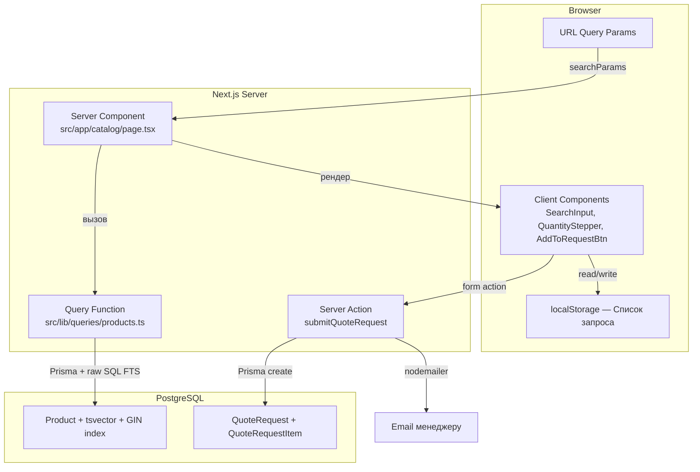
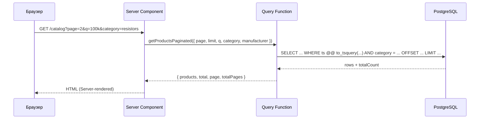
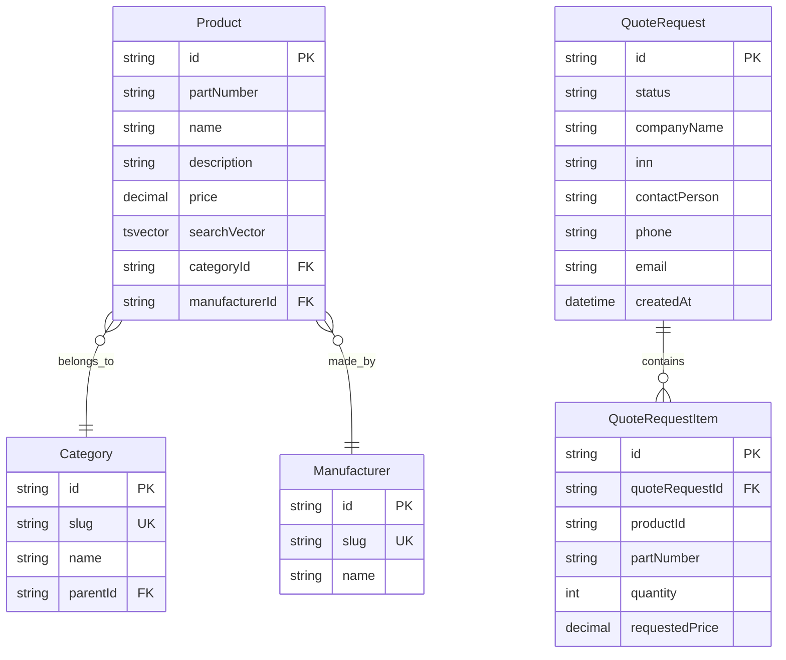

# Design Document — Каталог и модель заказа

## Overview

Проектирование серверного каталога товаров с полнотекстовым поиском, фильтрацией, пагинацией и моделью запроса коммерческого предложения (QuoteRequest). Каталог содержит ~62 627 товаров в PostgreSQL. Архитектура построена на Server Components (Next.js 15 App Router) с минимальными клиентскими компонентами для интерактивности.

---

## Architecture

### Общая схема



### Поток данных каталога



---

## Components and Interfaces

### Серверные компоненты

| Файл | Ответственность |
|------|----------------|
| `src/app/catalog/page.tsx` | Читает `searchParams`, вызывает query, рендерит layout |
| `src/app/catalog/loading.tsx` | Skeleton-загрузка каталога |
| `src/app/catalog/error.tsx` | Обработка ошибок |

### Клиентские компоненты (`'use client'`)

| Файл | Ответственность |
|------|----------------|
| `src/app/catalog/components/search-input.tsx` | Поисковая строка с debounce, обновляет URL |
| `src/app/catalog/components/quantity-stepper.tsx` | Степпер количества с учётом minOrder |
| `src/app/catalog/components/add-to-request-btn.tsx` | Кнопка «Добавить в запрос» / индикатор «В списке» |
| `src/app/catalog/components/request-list-badge.tsx` | Бейдж с количеством позиций в списке запроса |
| `src/app/catalog/components/category-tree.tsx` | Дерево категорий (клиентский для expand/collapse) |

### Серверные функции

| Файл | Ответственность |
|------|----------------|
| `src/lib/queries/products.ts` | `getProductsPaginated()` — пагинация + FTS + фильтры |
| `src/lib/queries/categories.ts` | `getCategoriesWithCounts()` — дерево с подсчётом |
| `src/app/catalog/actions.ts` | Server action `submitQuoteRequest()` |

---

### Интерфейсы

### Параметры запроса каталога

```typescript
interface CatalogSearchParams {
  page?: string    // номер страницы, default "1"
  limit?: string   // товаров на странице, default "50"
  q?: string       // поисковый запрос (FTS)
  category?: string    // slug категории
  manufacturer?: string // slug производителя
}
```

### Результат пагинированного запроса

```typescript
interface PaginatedResult<T> {
  items: T[]
  total: number
  page: number
  limit: number
  totalPages: number
}
```

### Парсинг и валидация параметров

```typescript
interface ParsedCatalogParams {
  page: number       // >= 1, clamped to totalPages
  limit: number      // default 50, max 100
  query: string | null
  categorySlug: string | null
  manufacturerSlug: string | null
}

function parseCatalogParams(
  searchParams: CatalogSearchParams,
  totalItems: number,
): ParsedCatalogParams
```

### Форматирование цены

```typescript
/**
 * Форматирует цену для отображения.
 * null → "Цена по запросу"
 * number → "1 234 ₽"
 */
function formatPrice(price: number | null, currency?: string): string
```

### Список запроса (localStorage)

```typescript
interface RequestListItem {
  productId: string
  partNumber: string
  name: string
  manufacturer: string
  quantity: number
  minOrder: number
  price: number | null
}

interface RequestListStore {
  items: RequestListItem[]
  updatedAt: string // ISO timestamp
}
```

### QuoteRequest Server Action

```typescript
interface QuoteRequestInput {
  companyName: string
  inn?: string
  contactPerson: string
  phone: string
  email: string
  comment?: string
  deliveryAddress?: string
  desiredDeliveryDate?: string
  items: Array<{
    productId: string
    partNumber: string
    name: string
    quantity: number
    requestedPrice?: number
  }>
}

type QuoteRequestResult =
  | { success: true; requestId: string }
  | { success: false; error: string }

async function submitQuoteRequest(
  input: QuoteRequestInput,
): Promise<QuoteRequestResult>
```

---

## Data Models

### Миграция: tsvector для Product

```sql
-- Добавляем колонку tsvector
ALTER TABLE "Product"
ADD COLUMN "searchVector" tsvector
GENERATED ALWAYS AS (
  setweight(to_tsvector('russian', coalesce("partNumber", '')), 'A') ||
  setweight(to_tsvector('russian', coalesce("name", '')), 'B') ||
  setweight(to_tsvector('russian', coalesce("description", '')), 'C')
) STORED;

-- GIN-индекс для быстрого поиска
CREATE INDEX "Product_searchVector_idx" ON "Product" USING GIN ("searchVector");
```

### Prisma: QuoteRequest + QuoteRequestItem

```prisma
model QuoteRequest {
  id                  String              @id @default(cuid())
  status              String              @default("new") // new, in_progress, quoted, rejected

  // Контактные данные
  companyName         String
  inn                 String?
  contactPerson       String
  phone               String
  email               String
  comment             String?             @db.Text
  deliveryAddress     String?
  desiredDeliveryDate DateTime?

  // Позиции
  items               QuoteRequestItem[]

  // Метаданные
  createdAt           DateTime            @default(now())
  updatedAt           DateTime            @updatedAt

  @@index([status])
  @@index([createdAt])
  @@index([email])
}

model QuoteRequestItem {
  id              String        @id @default(cuid())
  quoteRequestId  String
  quoteRequest    QuoteRequest  @relation(fields: [quoteRequestId], references: [id], onDelete: Cascade)

  productId       String
  partNumber      String
  name            String
  quantity        Int
  requestedPrice  Decimal?      @db.Decimal(10, 2)

  createdAt       DateTime      @default(now())

  @@index([quoteRequestId])
  @@index([productId])
}
```

### ER-диаграмма



---

## Error Handling

| Сценарий | Обработка |
|----------|-----------|
| `page` > maxPages | Clamping к последней странице |
| `page` < 1 или NaN | Fallback к page=1 |
| `limit` > 100 | Clamping к 100 |
| Невалидный `category` slug | Игнорируется, показываются все товары |
| Невалидный `manufacturer` slug | Игнорируется, показываются все товары |
| FTS-запрос с спецсимволами | Экранирование через `plainto_tsquery` |
| Ошибка сохранения QuoteRequest | Возврат `{ success: false, error }`, данные формы сохраняются |
| Ошибка отправки email | Логирование, запрос всё равно сохраняется в БД |
| localStorage недоступен | Graceful degradation, данные только в памяти |

---

## Ключевые решения

1. **PostgreSQL FTS вместо Meilisearch** — для каталога достаточно `tsvector` + GIN. Meilisearch остаётся для будущего автокомплита.
2. **Offset-based пагинация** — при 62K товарах offset работает приемлемо. Cursor-based усложнит URL-sharing.
3. **Server Components** — каталог рендерится на сервере, SEO из коробки.
4. **localStorage для списка запроса** — не требует авторизации, работает offline.
5. **Server Action для QuoteRequest** — без tRPC, прямой вызов из формы.
6. **`plainto_tsquery`** — безопасный парсинг пользовательского ввода без спецсимволов tsquery.

---

## Testing Strategy

### Unit-тесты (Vitest)

- `formatPrice()` — конкретные примеры форматирования
- `parseCatalogParams()` — edge cases (page=0, page=-1, limit=0)
- `RequestListStore` — добавление, удаление, изменение количества
- `validateQuoteRequestInput()` — невалидные данные формы

### Property-тесты (Vitest + fast-check)

- Все свойства из раздела Correctness Properties ниже
- Минимум 100 итераций на свойство
- Генераторы: случайные цены, параметры пагинации, товары, данные формы

### Integration-тесты (Playwright)

- FTS-поиск по реальной БД (2–3 примера)
- Фильтрация по категории + производителю
- Отправка QuoteRequest через форму

---

## Correctness Properties

*Свойство (property) — это характеристика или поведение, которое должно выполняться для всех допустимых входных данных системы. Свойства служат мостом между человекочитаемыми спецификациями и машинно-проверяемыми гарантиями корректности.*

### Property 1: Форматирование цены

*Для любого* числового значения цены (price > 0), функция `formatPrice` должна возвращать строку, содержащую символ валюты «₽» и корректно разделённые тысячи (пробелом). Для price === null функция должна возвращать строку «Цена по запросу».

**Validates: Requirements 1.2, 1.3**

### Property 2: Корректность пагинации (offset и clamping)

*Для любых* валидных значений `page` (≥ 1), `limit` (≥ 1) и `total` (≥ 0), функция `parseCatalogParams` должна:
- вычислять offset как `(clampedPage - 1) * limit`
- гарантировать что `clampedPage` ≤ `Math.ceil(total / limit)` (или 1 при total=0)
- гарантировать что отображаемый диапазон `[start, end]` корректен: `start = offset + 1`, `end = Math.min(offset + limit, total)`

**Validates: Requirements 2.3, 2.5, 2.6**

### Property 3: Фильтрация — результаты удовлетворяют условиям

*Для любого* набора товаров и комбинации фильтров (categorySlug, manufacturerSlug), все товары в результате должны одновременно принадлежать указанной категории И указанному производителю. Ни один товар, не удовлетворяющий обоим условиям, не должен присутствовать в результате.

**Validates: Requirements 4.4**

### Property 4: Round-trip списка запроса

*Для любого* набора `RequestListItem[]`, сериализация в localStorage и последующая десериализация должны возвращать эквивалентный массив с теми же productId, partNumber, name, manufacturer, quantity и price для каждого элемента.

**Validates: Requirements 5.2, 5.5**

### Property 5: Инвариант минимального заказа

*Для любого* товара в списке запроса, значение `quantity` всегда должно быть ≥ `minOrder` этого товара. Попытка установить quantity < minOrder должна быть отклонена или скорректирована до minOrder.

**Validates: Requirements 5.4**

### Property 6: Валидация QuoteRequest

*Для любого* валидного `QuoteRequestInput`, все обязательные поля (companyName, contactPerson, phone, email, items с хотя бы одной позицией) должны присутствовать и быть непустыми. Поле status при создании всегда должно быть одним из допустимых значений: «new», «in_progress», «quoted», «rejected».

**Validates: Requirements 6.3, 7.2**

### Property 7: Round-trip URL-параметров каталога

*Для любого* набора параметров каталога (page, limit, q, category, manufacturer), сериализация в URL query string и обратный парсинг должны возвращать эквивалентный набор параметров. Прямая ссылка на любую комбинацию фильтров должна воспроизводить то же состояние каталога.

**Validates: Requirements 8.1, 8.3**
