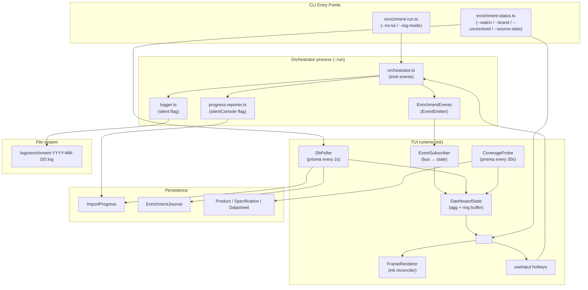

# Design Document

Дизайн: live observability обогатителя (enrichment-live-observability)

## Overview

Фича добавляет к существующему обогатителю (`pnpm enrichment:run`, entry `src/scripts/enrichment-run.ts`) живой TUI-дашборд и расширяет CLI команды `pnpm enrichment:status` богатыми разрезами (`--watch`, `--brand`, `--unresolved`, `--source-stats`). Цель — заменить «стену JSON-логов» интерактивной htop-подобной панелью, по которой владелец магазина за секунду видит:

- сколько MPN осталось из исходных 69 116 строк Excel,
- какой бренд / источник сейчас обрабатывается,
- coverage по описаниям/спекам/datasheet/категории,
- лента последних обработанных MPN и последние «не найденные».

Ключевые архитектурные принципы:

1. **In-process event bus** — оркестратор обогатителя выпускает типизированные события (`mpn_started`, `mpn_completed`, `phase_changed`, `mouser_quota_used`, `paused`, `resumed`, `shutdown_initiated`) через Node `EventEmitter`. TUI-рендерер подписывается синхронно — без БД-запросов на каждый кадр.
2. **Двойной источник данных**. В режиме `enrichment:run` дашборд питается событиями из event-bus. В режиме `enrichment:status --watch` дашборд работает в отдельном процессе и читает БД (`ImportProgress`, `EnrichmentJournal`) с интервалом 2 с.
3. **`ink` как TUI-runtime** (см. раздел «Components / TUI Runtime»). React-подобный декларативный UI, штатная частичная перерисовка, авто-детект `isTTY`, удобная обработка hotkeys через `useInput`.
4. **Совместимость с JSON-логами**. Существующий `logger.ts` пишет в `logs/enrichment-YYYY-MM-DD.log` без изменений формата. В TUI-режиме подавляется только консольный stream через флаг `silent`; запись в файл идёт всегда.
5. **Чистое ядро метрик**. Расчёты `remainingFromExcel`, `speedShort`, `speedLong`, `eta`, `hitRate` вынесены в чистые функции без зависимости от БД и stdout — для unit и property-based тестов.
6. **Бюджет ресурсов**. Не более 5% CPU и 50 МБ RAM сверх обогатителя. Coverage обновляется не чаще раза в 30 с, лента событий — ring buffer, рендер с back-pressure (пропуск кадра, если предыдущий не дорисован).

Спека НЕ реализует graceful shutdown (см. `enrichment-shutdown-and-block-detection`), детекцию блокировки ChipDip (там же), извлечение characteristics (`fix-chipdip-specs-extraction`) и не вводит веб-дашборд.

## Glossary

- **TUI-дашборд** — интерактивная текстовая панель в терминале с обновляемыми блоками, реализованная на `ink`.
- **Event bus** — экземпляр `EnrichmentEvents` (типизированный обёрткой `EventEmitter`), создаваемый оркестратором; единственный канал live-обновлений для TUI в режиме `--run`.
- **DashboardState** — in-memory агрегатор последних событий (счётчики, топ-10 брендов, ring buffer ленты, кэш coverage). Один экземпляр на процесс.
- **Snapshot source** — функция `loadDashboardSnapshot()` (Prisma + лог-агрегатор), используемая `enrichment:status` без `--watch` и `enrichment:status --watch` для опроса БД каждые 2 с.
- **Coverage-метрика** — доля `Product`-записей со статусом `complete`/`partial`, у которых заполнено описание / есть спецификации / есть datasheet / категория ≠ `uncategorized`. Считается через прямые SQL-агрегаты (Prisma `count`).
- **Ring buffer** — фиксированной длины массив (16 элементов) последних обработанных MPN; самые старые вытесняются.
- **Back-pressure** — механизм пропуска кадра рендеринга, если предыдущий ещё не отрендерился (ink сам держит очередь, мы дополнительно блокируем `setState` через `requestAnimationFrame`-аналог `setImmediate`).
- **Hotkey-handler** — компонент `useInput` (`ink`), маппит клавиши на действия `shutdown`, `togglePause`, `toggleHelp`.
- **Live-mode** — режим, в котором TUI получает события из event-bus (запущен в одном процессе с обогатителем).
- **Watch-mode** — режим, в котором TUI получает данные через polling БД в отдельном процессе; не управляет обогатителем.

## Architecture

### Диаграмма компонентов



### Сценарий 1: `pnpm enrichment:run` (live-mode)

```
user shell
  │
  ▼
enrichment-run.ts
  ├── parseCliArgs() → { tui: true | false }     (req 1.6: --no-tui / --log-mode)
  ├── if !process.stdout.isTTY → tui = false      (req 1.5)
  ├── createLogger({ silent: tui })               (req 13.3)
  ├── createProgressReporter({ silentConsole: tui }) (req 13.5)
  ├── const bus = createEnrichmentEvents()        (req 12.2, 12.7)
  ├── runEnrichmentPipeline({ bus, ... })
  │     └── orchestrator.emit('mpn_started', ...)  ← в ключевых точках
  └── if tui: render(<App bus={bus} mode="live" />)
        └── ink mounts → EventSubscriber → DashboardState → Frames
```

### Сценарий 2: `pnpm enrichment:status --watch` (watch-mode)

```
user shell (другой терминал)
  │
  ▼
enrichment-status.ts
  ├── parseCliArgs() → { watch: true }
  ├── if !process.stdout.isTTY → fallback на статический снапшот
  └── render(<App mode="watch" />)
        ├── DbPoller every 2s → DashboardState
        ├── CoverageProbe every 30s → DashboardState
        └── useInput: q/Ctrl+C → exit; p → ignore (req 7.5)
```

### Сценарий 3: `pnpm enrichment:status` (snapshot, без флагов)

```
enrichment-status.ts
  ├── const snapshot = await loadDashboardSnapshot(prisma)
  ├── if !process.stdout.isTTY → strip ANSI
  └── printSnapshot(snapshot, stdout)   // одноразовый вывод, без живого рендеринга
```

## Components and Interfaces

### TUI Runtime: `ink`

**Выбор библиотеки.** Для рендера выбран [`ink`](https://github.com/vadimdemedes/ink) (v5+, ESM), а не `blessed`/`terminal-kit`, по совокупности:

| Критерий                              | ink                              | blessed                                | terminal-kit                  |
|---------------------------------------|----------------------------------|----------------------------------------|-------------------------------|
| Декларативная модель                  | JSX-компоненты                   | императивный API + box hierarchy       | императивный, ниже уровень    |
| Частичная перерисовка                 | reconciler diff'ит только дельту | вручную через `screen.render()`        | вручную                       |
| Hotkeys                               | `useInput` hook                  | `screen.key([...], handler)`           | `terminal.grabInput()`        |
| Авто-детект isTTY / colour            | да (`isCI`, `supports-color`)    | частично                               | частично                      |
| TypeScript типы                       | штатные                          | через `@types/blessed`                 | community-types               |
| Размер транзитивных зависимостей      | ~50 KB + react-reconciler        | ~250 KB                                | ~800 KB                       |
| Опыт команды (стек React/Next)        | прямой перенос                   | новый ментальный модель                | новый ментальный модель       |

`ink` совпадает по парадигме со всем остальным проектом (React/Next.js), декларативность упрощает поддержку — добавление блока сводится к `<Box>...</Box>`. Для частичной перерисовки используется встроенный reconciler. Для статичных верхних блоков (`Header`) используется `<Static>`, чтобы они не перерисовывались каждый кадр.

**Зависимости** (добавляются в `package.json`):

```
"ink": "^5.0.1",
"react": "^18.3.1",   // peer для ink
"@types/react": "^18.3.5"
```

(Версия React фиксируется в линии с уже используемой Next.js 15 / React 19; при конфликте `ink@5` peers выбираем именно версию, которая идёт в `peerDependencies` ink, и ставим её только для CLI-bundle через `pnpm add -D`. Точные версии будут уточнены в tasks.md в момент установки.)

### Структура компонентов TUI

```
<App mode="live" | "watch" | "snapshot">
├── <Header />                  // runId, режим, фаза, индикатор паузы
├── <ProgressBar />             // X / Y MPN, %, прогресс-бар
├── <ExcelRemainder />          // "Осталось из Excel: A / 69116 (B%)"
├── <CurrentTask />             // MPN, бренд, время старта, ETA
├── <SpeedPanel />               // speedShort, speedLong, uptime
├── <StatusCounters />          // chipdip_done / chipdip_not_found / ... 
├── <SourcesBreakdown />        // %ChipDip / %LCSC / %Mouser
├── <BrandsBreakdown />         // топ-10 брендов: done / remaining
├── <MouserQuota />             // X / 1000 на сегодня
├── <Coverage />                // description / specs / datasheet / category — %
├── <EventLog />                // ring buffer 10–20 строк
├── <NotFoundList />            // последние 5 not_found
├── <Footer />                  // подсказка hotkeys: q quit, p pause, ? help
└── <HelpOverlay visible={...}> // overlay со списком всех hotkeys
```

Каждый компонент подписывается на узкий срез `DashboardState` (через `useDashboardSelector(selectorFn)`), чтобы перерисовывать только изменившийся блок (req 1.3).

### Event bus

**Файл:** `src/lib/enrichment/observability/event-bus.ts`

```typescript
import { EventEmitter } from 'node:events'

export type EnrichmentSourceKind = 'chipdip' | 'lcsc' | 'mouser'
export type EnrichmentPhase =
  | 'idle'
  | 'chipdip-queue'
  | 'lcsc-queue'
  | 'mouser-queue'
  | 'shutting-down'

export type EnrichmentJournalStatus =
  | 'pending'
  | 'chipdip_done' | 'chipdip_not_found' | 'chipdip_blocked'
  | 'lcsc_done'    | 'lcsc_not_found'    | 'lcsc_blocked'
  | 'mouser_done'  | 'mouser_not_found'  | 'mouser_failed' | 'mouser_brand_mismatch'
  | 'done' | 'unresolved'

export interface EnrichmentEventMap {
  mpn_started:       { mpn: string; brand: string; source: EnrichmentSourceKind; timestamp: number }
  mpn_completed:     { mpn: string; brand: string; source: EnrichmentSourceKind; status: EnrichmentJournalStatus; durationMs: number; timestamp: number }
  phase_changed:     { from: EnrichmentPhase; to: EnrichmentPhase; timestamp: number }
  mouser_quota_used: { used: number; limit: number; timestamp: number }
  paused:            { reason: 'hotkey' | 'block' | 'manual'; timestamp: number }
  resumed:           { timestamp: number }
  shutdown_initiated:{ source: 'hotkey' | 'signal'; timestamp: number }
}

export interface EnrichmentEvents {
  emit<K extends keyof EnrichmentEventMap>(event: K, payload: EnrichmentEventMap[K]): void
  on<K extends keyof EnrichmentEventMap>(event: K, handler: (payload: EnrichmentEventMap[K]) => void): () => void
  off<K extends keyof EnrichmentEventMap>(event: K, handler: (payload: EnrichmentEventMap[K]) => void): void
}

export function createEnrichmentEvents(): EnrichmentEvents {
  const emitter = new EventEmitter()
  emitter.setMaxListeners(50)
  return {
    emit: (event, payload) => emitter.emit(event, payload),
    on: (event, handler) => {
      const safeHandler = (p: unknown): void => {
        try { handler(p as never) } catch (err) {
          // Req 12.6: subscriber crash MUST NOT stop the orchestrator.
          // Log via console.error to stderr (file logger may be silenced).
          process.stderr.write(`[event-bus] subscriber error for ${event}: ${String(err)}\n`)
        }
      }
      emitter.on(event, safeHandler)
      return () => emitter.off(event, safeHandler)
    },
    off: (event, handler) => emitter.off(event, handler as (p: unknown) => void),
  }
}
```

Точки эмита в `orchestrator.ts`:

| Место (тип события)         | Что эмитится                                                              |
|------------------------------|---------------------------------------------------------------------------|
| Перед `searchMpn(mpn)`       | `mpn_started`                                                             |
| После `searchMpn` + persist  | `mpn_completed` с финальным `EnrichmentJournalStatus`                     |
| Переход между очередями      | `phase_changed`                                                           |
| Каждый запрос к Mouser API   | `mouser_quota_used` (используется текущим счётчиком + 1)                  |
| Hotkey `p` или внешняя пауза | `paused` / `resumed`                                                      |
| Получение SIGINT/Ctrl+C      | `shutdown_initiated`                                                      |

Контракт: `EnrichmentEvents` передаётся в `runEnrichmentPipeline(config)` через `config.bus?: EnrichmentEvents`. Если `bus` не передан, оркестратор получает `no-op`-эмиттер (тесты, dry-run без TUI).

### DashboardState

**Файл:** `src/lib/enrichment/observability/dashboard-state.ts`

```typescript
export interface DashboardState {
  runId: string | null
  phase: EnrichmentPhase
  paused: boolean
  startedAt: number | null
  uptimeMs: number

  // requirement 2
  totalInQueue: number
  processedInQueue: number
  excelTotal: number          // 69_116 default; см. ниже
  excelRemaining: number      // computed

  // requirement 3
  statusCounts: Record<EnrichmentJournalStatus, number>
  brandStats: Map<string, { done: number; remaining: number }>  // top-10 by total
  sourcesPercent: { chipdip: number; lcsc: number; mouser: number }
  mouserQuota: { used: number; limit: number }                  // limit=1000

  // requirement 4
  recentEvents: RingBuffer<RecentEvent>      // capacity = 16
  recentNotFound: RingBuffer<NotFoundEntry>  // capacity = 5

  // requirement 11
  coverage: {
    description: number; specs: number; datasheet: number; category: number
    updatedAt: number
  } | null

  // requirement 2.5
  speedShortPerMin: number   // sliding window 5 min
  speedLongPerHour: number   // since startedAt
  etaSeconds: number | null

  // current MPN
  currentMpn: { mpn: string; brand: string; startedAt: number } | null
}

export interface DashboardStateAPI {
  getState(): Readonly<DashboardState>
  applyEvent<K extends keyof EnrichmentEventMap>(event: K, payload: EnrichmentEventMap[K]): void
  applySnapshot(snapshot: DashboardSnapshot): void   // for watch-mode polling
  applyCoverage(coverage: CoverageMetrics): void
  subscribe(listener: () => void): () => void        // re-render trigger
}
```

Источник `excelTotal` (req 12.4):

1. Если есть активный `ImportProgress` — `excelTotal = ImportProgress.totalProducts`.
2. Иначе fallback на константу `EXCEL_TOTAL_DEFAULT = 69_116` (объявляется в `src/lib/enrichment/constants/observability.ts`).
3. Если БД недоступна — отображается `? / 69116` (req 12.5).

`excelRemaining`:

```sql
SELECT COUNT(*) FROM "EnrichmentJournal"
 WHERE "status" NOT IN ('done', 'unresolved')
```

(плюс число MPN, которых ещё нет в журнале — `excelTotal - excelProcessed`, где `excelProcessed = SUM(done) + SUM(unresolved)`).

### Subscribers

**Файл:** `src/lib/enrichment/observability/event-subscriber.ts`

Один обработчик на каждый тип события из `EnrichmentEventMap`, синхронно мутирующий `DashboardState`. Например:

```typescript
function handleMpnCompleted(state: DashboardState, p: EnrichmentEventMap['mpn_completed']): void {
  state.statusCounts[p.status] += 1
  state.processedInQueue += 1
  state.recentEvents.push({ mpn: p.mpn, brand: p.brand, status: p.status, ts: p.timestamp })
  if (isNotFoundStatus(p.status) || p.status === 'unresolved') {
    state.recentNotFound.push({ mpn: p.mpn, brand: p.brand, source: p.source, ts: p.timestamp })
  }
  bumpBrandStats(state.brandStats, p.brand, isFinal(p.status))
  state.currentMpn = null
}
```

### DbPoller (watch-mode)

**Файл:** `src/lib/enrichment/observability/db-poller.ts`

```typescript
export function startDbPoller(api: DashboardStateAPI, intervalMs = 2000): () => void
```

Каждые 2 секунды:
1. `prisma.importProgress.findFirst({ orderBy: { createdAt: 'desc' } })`
2. `prisma.enrichmentJournal.groupBy({ by: ['status'], _count: { status: true } })`
3. Топ-10 брендов: `prisma.enrichmentJournal.groupBy({ by: ['brand', 'status'], _count: true, take: ...})` с агрегацией в коде.
4. Последние 16 событий: `prisma.enrichmentJournal.findMany({ orderBy: { updatedAt: 'desc' }, take: 16 })`.
5. Mouser-квота на сегодня: тот же подсчёт, что в текущем `enrichment-status.ts`.

### CoverageProbe

**Файл:** `src/lib/enrichment/observability/coverage-probe.ts`

```typescript
export interface CoverageMetrics {
  totalEnriched: number
  withDescription: number
  withSpecs: number
  withDatasheet: number
  withCategory: number
}
export function startCoverageProbe(api: DashboardStateAPI, intervalMs = 30_000): () => void
export async function loadCoverage(): Promise<CoverageMetrics | null>
```

Запросы (Prisma, прямые SQL-агрегаты — req 11.3):

```typescript
const baseWhere = { enrichmentStatus: { in: ['complete', 'partial'] as const } }

const [total, withDescription, withSpecs, withDatasheet, withCategory] = await prisma.$transaction([
  prisma.product.count({ where: baseWhere }),
  prisma.product.count({
    where: { ...baseWhere, description: { not: null }, NOT: { description: { in: ['', 'Нет данных'] } } },
  }),
  prisma.product.count({ where: { ...baseWhere, specifications: { some: {} } } }),
  prisma.product.count({ where: { ...baseWhere, datasheets: { some: {} } } }),
  prisma.product.count({
    where: { ...baseWhere, NOT: { category: { slug: 'uncategorized' } } },
  }),
])
```

Если `total === 0`, возвращается `null`, что в UI рендерится как «Coverage: нет обработанных товаров» (req 11.4).
Кэшируется на 30 секунд внутри `DashboardState.coverage.updatedAt`.

### Metrics (чистые функции)

**Файл:** `src/lib/enrichment/observability/metrics.ts`

```typescript
export function computeExcelRemaining(args: { excelTotal: number; doneCount: number; unresolvedCount: number }): { remaining: number; processed: number; percent: number }

export function computeSpeedShort(events: ReadonlyArray<{ ts: number }>, nowMs: number, windowMs = 5*60_000): number
export function computeSpeedLong(processed: number, startedAtMs: number, nowMs: number): number
export function computeEtaSeconds(remaining: number, speedPerMin: number): number | null

export interface SourceCounts { chipdip: number; lcsc: number; mouser: number }
export function computeSourcesPercent(counts: SourceCounts): { chipdip: number; lcsc: number; mouser: number }
// invariant: chipdip + lcsc + mouser ∈ [99, 101] (rounding tolerance ±1)

export interface SourceAttempts { done: number; notFound: number; blocked?: number; failed?: number }
export function computeHitRate(attempts: SourceAttempts): number
```

Эти функции — единственные «единицы измерений» дашборда; все они тестируются и unit-, и property-based-тестами (см. Testing Strategy).

### Logger / ProgressReporter — изменения

`logger.ts`: добавляется флаг `silent` в фабрику.

```typescript
export interface CreateLoggerOptions { logDir?: string; silent?: boolean }
export function createLogger(options?: CreateLoggerOptions): EnrichmentLogger
// silent=true: пропускаем console.log/warn/error, файловую запись оставляем.
```

`progress-reporter.ts`: добавляется `silentConsole`.

```typescript
export interface CreateProgressReporterOptions { silentConsole?: boolean }
export function createProgressReporter(options?: CreateProgressReporterOptions): ProgressReporter
// silentConsole=true: 60-секундная сводка не печатается, БД-апдейт каждые 30с продолжается.
```

Точечные правки в существующем коде, **формат JSON-записи в файл не меняется** (req 13.1, 13.2). Добавляется только новое событие `tui_init_failed` (req 1.8).

### CLI argument parser

**Файл:** `src/lib/enrichment/observability/cli-args.ts`

Расширяем существующий парсер из `enrichment-run.ts` и копируем подход для `enrichment-status.ts`. Никаких внешних библиотек (`commander`, `yargs`) — оставляем простой свитч в духе текущего кода.

```typescript
export interface RunCliFlags {
  noTui: boolean        // --no-tui / --log-mode
  /* ...все существующие флаги... */
}
export interface StatusCliFlags {
  watch: boolean
  brand: string | null
  unresolved: boolean
  json: boolean
  sourceStats: boolean
  period: { from: Date; to: Date } | null   // --period 2025-01-01..2025-01-07
}
export function parseRunArgs(argv: string[]): RunCliFlags
export function parseStatusArgs(argv: string[]): StatusCliFlags
```

### Hotkeys

`<App>` использует `useInput` (`ink`):

```tsx
useInput((input, key) => {
  if (key.ctrl && input === 'c') return triggerShutdown()    // req 5.1
  if (input === 'q')              return triggerShutdown()
  if (input === 'p') {
    if (mode === 'watch') return                             // req 7.5: ignore
    return togglePause()                                     // req 5.3
  }
  if (input === '?') return toggleHelp()                     // req 5.5
  // any other key — silently ignored (req 5.6)
})
```

`triggerShutdown()` в live-mode вызывает существующий `shutdownWithCleanup()` из `browser-registry.ts` (см. соседнюю спеку shutdown). В watch-mode — просто `process.exit(0)`. Реакция на `Ctrl+C` ≤ 100 мс обеспечивается тем, что `useInput` обрабатывает stdin синхронно, до следующего render-tick (req 5.2).

### Status snapshot (без флагов)

**Файл:** `src/scripts/enrichment-status.ts` (расширяется)

Существующий код заменяется на:

```typescript
const flags = parseStatusArgs(process.argv)

if (flags.watch)        return runWatchMode(flags)
if (flags.brand)        return runBrandReport(flags.brand, flags)
if (flags.unresolved)   return runUnresolvedReport(flags)
if (flags.sourceStats)  return runSourceStatsReport(flags)

const snapshot = await loadDashboardSnapshot(prisma)
printSnapshot(snapshot, { color: process.stdout.isTTY })
```

`printSnapshot` рендерит через `ink`-функцию `render(<App mode="snapshot" state={snapshot} />, { stdout })`, после `waitUntilExit()` процесс завершается. Если `!isTTY` — ANSI вырезается через `strip-ansi` или `chalk.level = 0` (req 6.4).

## Data Flow

### Live-mode: путь события `mpn_completed`

```
orchestrator.processOneMpn(mpn)
  ├── Date.now() → startTs
  ├── bus.emit('mpn_started', { mpn, brand, source: 'chipdip', timestamp: startTs })
  │     → EventSubscriber (TUI process, sync)
  │         └── state.currentMpn = { mpn, brand, startedAt }; state.notify()
  │             └── ink reconciler: re-render <CurrentTask /> only
  │
  ├── result = await chipdip.searchMpn(mpn)
  ├── persistBatch([result])
  ├── journal.markStatus(mpn, 'chipdip_done')
  ├── const durationMs = Date.now() - startTs
  ├── logger.info({ mpn, brand, source: 'chipdip', event: 'mpn_completed', durationMs })  ← в файл
  └── bus.emit('mpn_completed', { mpn, brand, source: 'chipdip', status: 'chipdip_done', durationMs, timestamp: Date.now() })
        → EventSubscriber
            ├── state.statusCounts.chipdip_done += 1
            ├── state.recentEvents.push(...)
            ├── state.brandStats.bumpDone(brand)
            ├── state.processedInQueue += 1
            ├── recompute speedShort / speedLong / eta
            └── state.notify()
                └── ink: re-render <StatusCounters />, <EventLog />, <SpeedPanel />, <ProgressBar />
```

Время от `bus.emit` до изменения пикселей в терминале: один tick `setImmediate` + один react-reconciler diff = **< 5 мс на стандартной нагрузке**.

### Watch-mode: путь обновления

```
DbPoller (every 2000ms)
  ├── const summary = await loadDashboardSnapshot(prisma)
  └── api.applySnapshot(summary)
        ├── replace statusCounts, brandStats, recentEvents, recentNotFound
        └── notify subscribers
              └── ink: re-render всех изменившихся блоков

CoverageProbe (every 30000ms)
  ├── const cov = await loadCoverage()
  └── api.applyCoverage(cov)
        └── ink: re-render <Coverage />
```

### Snapshot-mode

Один проход `loadDashboardSnapshot()` → `loadCoverage()` → `printSnapshot()` → exit. БД соединение закрывается через `prisma.$disconnect()` (как уже сделано в текущем `enrichment-status.ts`).

## Data Models

Эта спека **не меняет схему Prisma**. Используются существующие модели:

- `ImportProgress` — `runId`, `status`, `totalProducts`, `importedProducts`, `failedProducts`, `importSpeed`, `estimatedTimeRemaining`, `createdAt`, `updatedAt`.
- `EnrichmentJournal` — `mpn`, `originalMpn`, `brand`, `status` (enum выше), `lastSource`, `mouserDay`, `runId`, `createdAt`, `updatedAt`, опц. `errorMessage`.
- `Product` / `Specification` / `Datasheet` / `Category` — для расчёта coverage.

Новый in-memory тип `DashboardState` описан в разделе «Components / DashboardState». Никаких миграций не требуется.

Константа `EXCEL_TOTAL_DEFAULT = 69_116` хранится в `src/lib/enrichment/constants/observability.ts` рядом с прочими константами обогатителя.

## Correctness Properties


*Свойство — это характеристика или поведение, которое должно соблюдаться для всех валидных запусков системы; формальное утверждение о том, что система обязана делать. Свойства служат мостом между требованиями на естественном языке и машинно-проверяемыми гарантиями корректности.*

PBT применим к этой фиче в той части, где есть **чистые функции метрик и in-memory state-машины** (расчёты процентов / ETA / скорости, ring buffer, агрегаторы счётчиков, парсер CLI-флагов, фильтр/сортировка списков, isolation event-bus). Для UI-рендеринга и тайминга используются example-based / snapshot-тесты (см. Testing Strategy).

### Property 1: Прогрессовая арифметика консистентна

*For any* `excelTotal ≥ 0`, `doneCount ≥ 0`, `unresolvedCount ≥ 0` где `doneCount + unresolvedCount ≤ excelTotal`, функция `computeExcelRemaining(...)` возвращает `remaining = excelTotal - doneCount - unresolvedCount`, `processed = doneCount + unresolvedCount`, и `percent ∈ [0, 100]`. Для `excelTotal = 0` percent = 0 и remaining = 0.

**Validates: Requirements 2.1, 2.2**

### Property 2: ETA согласован со скоростью и остатком

*For any* `remaining ≥ 0` и `speedPerMin > 0`, `computeEtaSeconds(remaining, speedPerMin) = round(remaining / speedPerMin * 60)` и результат ≥ 0. Для `speedPerMin = 0` функция возвращает `null`. Для `remaining = 0` функция возвращает `0`.

**Validates: Requirements 2.4**

### Property 3: Скорость в скользящем окне корректна

*For any* массива событий с timestamps и фиксированного «сейчас» `now`, `computeSpeedShort(events, now, windowMs)` равен числу событий с `ts ∈ [now - windowMs, now]`, делённому на `windowMs/60_000`. `computeSpeedLong(processed, startedAt, now) = processed / ((now - startedAt) / 3_600_000)` для `now > startedAt`.

**Validates: Requirements 2.5**

### Property 4: Счётчики статусов консистентны с потоком событий

*For any* конечной последовательности `mpn_completed`-событий, после прогона через `applyEvent` имеем: `sum(state.statusCounts) === events.length` и для каждого статуса `state.statusCounts[s] === count(events, e => e.status === s)`.

**Validates: Requirements 3.1, 12.7**

### Property 5: Сумма процентов по источникам равна 100 ± 1

*For any* валидного `SourceCounts { chipdip, lcsc, mouser } ≥ 0` где сумма ≥ 1, `computeSourcesPercent(counts).chipdip + .lcsc + .mouser ∈ [99, 101]`. Когда сумма = 0, все три значения равны 0.

**Validates: Requirements 3.3, 15.2**

### Property 6: Ring buffer сохраняет только последние N

*For any* конечной последовательности `push`-операций в `RingBuffer<T>(capacity = N)`, после M пушей `buffer.size === min(M, N)`, и `buffer.toArray()` равен последним `min(M, N)` пушенным элементам в порядке от нового к старому.

**Validates: Requirements 4.1, 14.3**

### Property 7: Logger в режиме silent подавляет console, но не файл

*For any* валидной `LogEntry`, при `silent: true` фабрика `createLogger` НЕ вызывает `console.log/warn/error`, но всегда вызывает `fs.appendFileSync` с одной JSON-строкой. При `silent: false` вызываются и console, и файл.

**Validates: Requirements 1.4, 13.3, 13.4**

### Property 8: Парсер CLI распознаёт --no-tui / --log-mode

*For any* `argv: string[]` без управляющих токенов, `parseRunArgs(argv).noTui === true` тогда и только тогда, когда `argv` содержит хотя бы один из токенов `'--no-tui'` или `'--log-mode'`.

**Validates: Requirements 1.6**

### Property 9: Hotkey toggle обладает round-trip-свойством

*For any* конечной последовательности нажатий `'p'` (или `'?'`) длиной `N`, состояние `state.paused` (или `state.helpVisible`) равно `initial XOR (N % 2 === 1)`. То есть чётное число нажатий возвращает в исходное состояние.

**Validates: Requirements 5.3, 5.5**

### Property 10: Неизвестные клавиши не меняют state и не выкидывают исключений

*For any* клавиши вне множества `{q, p, ?, Esc, Ctrl+C}`, обработчик `handleKey` НЕ изменяет `DashboardState` и НЕ выбрасывает исключений.

**Validates: Requirements 5.6**

### Property 11: Snapshot без TTY не содержит ANSI-escape-кодов

*For any* `DashboardState`, при `isTTY = false` функция `printSnapshot(state)` возвращает строку, не содержащую последовательностей `\x1b[`.

**Validates: Requirements 4.3, 6.4**

### Property 12: Поиск по бренду регистронезависим

*For any* известного канонического бренда `B` и любой `mixCase(B)` (case-вариант), запрос `--brand mixCase(B)` возвращает тот же набор записей, что и `--brand B`.

**Validates: Requirements 8.1**

### Property 13: Списки ошибок и unresolved корректно фильтруются, сортируются и лимитируются

*For any* множества записей `EnrichmentJournal`, отчёт `--brand <B>` для последних ошибок:
1. содержит только записи с `brand` (case-insensitive) равен `B` И `status ∈ {*_blocked, *_failed, *_not_found}`;
2. упорядочен по `updatedAt` DESC;
3. имеет длину `min(10, |filtered|)`.

Аналогично для `--unresolved`: фильтр `status === 'unresolved'`, DESC по `updatedAt`, лимит 100 (без `--json`) или без лимита (с `--json`).

**Validates: Requirements 8.3, 9.1, 9.3, 9.4, 9.5**

### Property 14: Hit rate и статистики длительностей лежат в корректных диапазонах

*For any* `SourceAttempts { done, notFound, blocked?, failed? } ≥ 0` где общее число > 0, `computeHitRate(attempts) ∈ [0, 1]`. *For any* непустого массива длительностей `durations ≥ 0`, `computeDurationStats(durations)` удовлетворяет `0 ≤ avg`, `median ≤ p95`, `min ≤ median ≤ max`. Для пустого массива возвращается `null`.

**Validates: Requirements 10.2, 10.3**

### Property 15: Coverage-метрики лежат в [0, 1]

*For any* `CoverageMetrics { totalEnriched, withDescription, withSpecs, withDatasheet, withCategory }` с `totalEnriched > 0` и каждым `withX ≤ totalEnriched`, расчётные доли `withX / totalEnriched ∈ [0, 1]`. Для `totalEnriched === 0` функция возвращает `null` (UI отображает «нет обработанных товаров»).

**Validates: Requirements 11.1, 11.4**

### Property 16: Источник `excelTotal` выбирается по приоритету

*For any* комбинации `progress: ImportProgress | null`, `resolveExcelTotal(progress)` возвращает `progress.totalProducts`, если `progress !== null` и `progress.totalProducts > 0`; иначе константу `EXCEL_TOTAL_DEFAULT = 69_116`.

**Validates: Requirements 12.4, 12.5**

### Property 17: Event-bus изолирует падение подписчика

*For any* обработчика `handler`, который выбрасывает любое `Error` при вызове, и любого `event` из `EnrichmentEventMap`, вызов `bus.emit(event, payload)` после `bus.on(event, handler)` НЕ выкидывает наружу и не нарушает работу других подписчиков того же события.

**Validates: Requirements 12.6, 15.3**

## TUI Layout

Базовая раскладка (≥ 80 столбцов × ≥ 24 строки):

```
┌─ Enrichment Live  run-2025-03-15-14-30-00      Phase: ChipDip queue  [● PAUSED?] ─┐
│                                                                                    │
│ Прогресс очереди: ████████████░░░░░░░░░░  6 234 / 18 500 MPN  (33%)               │
│ Осталось из Excel: 52 312 / 69 116 (24%)                                           │
│                                                                                    │
│ Сейчас обрабатывается: STM32F469ZIT6  STMicroelectronics   старт 14:32:01          │
│ ETA: 2 дня 04:17    Скорость: 48 MPN/мин (5 мин)  /  41 MPN/час  uptime 18:32:11  │
│                                                                                    │
│ ┌─ Статусы ──────────────────────┐ ┌─ Источники ──────────┐ ┌─ Mouser ───────────┐│
│ │ ChipDip ✓ done       4 521     │ │ ChipDip   58%        │ │ 217 / 1000 сегодня ││
│ │ ChipDip ✗ not_found  1 232     │ │ LCSC      27%        │ └────────────────────┘│
│ │ ChipDip ⚠ blocked       12     │ │ Mouser    15%        │                       │
│ │ LCSC    ✓ done         837     │ └──────────────────────┘                       │
│ │ LCSC    ✗ not_found    402     │                                                 │
│ │ Mouser  ✓ done         217     │ ┌─ Coverage (БД) ─────────────────────────────┐│
│ │ Mouser  ✗ not_found     45     │ │ description  92%   datasheet  61%           ││
│ │ unresolved              63     │ │ specs        78%   category   88%           ││
│ └────────────────────────────────┘ └─────────────────────────────────────────────┘│
│                                                                                    │
│ ┌─ Топ-10 брендов ────────────────────┐ ┌─ Лента событий (16) ─────────────────┐ │
│ │ STMicroelectronics  done 412 / rem 88│ │ ✓ 14:32:05  STM32F469ZIT6   STM ✓done│ │
│ │ Texas Instruments   done 388 / rem 102│ │ ✗ 14:32:03  TLP627-2GB      TI  ✗nf │ │
│ │ Analog Devices      done 290 / rem 60 │ │ ⚠ 14:32:01  AD7124-8        ADI ⚠blk│ │
│ │ Microchip           done 274 / rem 75 │ │ ✓ 14:31:58  ATMEGA328P-PU   MCH ✓d  │ │
│ │ ...                                   │ │ ...                                   │ │
│ └───────────────────────────────────────┘ └───────────────────────────────────────┘ │
│                                                                                    │
│ ┌─ Последние не найденные ──────────────────────────────────────────────────────┐ │
│ │ TLP627-2GB         Toshiba          chipdip                  14:32:03         │ │
│ │ XYZ-CUSTOM-PART    UnknownVendor    mouser (brand mismatch)  14:30:47         │ │
│ └────────────────────────────────────────────────────────────────────────────────┘│
│                                                                                    │
│ q: quit  p: pause/resume  ?: help                                                 │
└────────────────────────────────────────────────────────────────────────────────────┘
```

При нажатии `?` поверх рендера накладывается overlay-блок:

```
        ┌─ Hotkeys ────────────────────────────────────────┐
        │ q          выйти (graceful shutdown)             │
        │ Ctrl+C     то же                                 │
        │ p          пауза / возобновить                   │
        │ ?  /  Esc  скрыть эту подсказку                  │
        └──────────────────────────────────────────────────┘
```

При размере терминала < 80 × 20 (req 1.7) рендерятся только три блока: ProgressBar, CurrentTask, StatusCounters — плюс предупреждающая строка «Терминал слишком мал для полного дашборда».

## CLI Flags Reference

### `pnpm enrichment:run`

| Флаг                | Тип   | По умолчанию | Описание                                                       |
|---------------------|-------|--------------|----------------------------------------------------------------|
| `--no-tui`          | bool  | false        | Отключить TUI, использовать legacy-режим JSON-логов в stdout. Алиас: `--log-mode`. |
| `--log-mode`        | bool  | false        | Алиас `--no-tui`.                                              |
| (существующие)      | —     | —            | `--input-dir`, `--batch-size`, `--resume`, `--dry-run`, `--skip-mouser`, `--skip-lcsc`, `--mouser-only` — без изменений. |

Поведение по умолчанию: если `process.stdout.isTTY === true` И ни `--no-tui`, ни `--log-mode` не заданы — TUI ON. Иначе — TUI OFF (legacy).

### `pnpm enrichment:status`

| Флаг                  | Тип    | Описание                                                                            |
|-----------------------|--------|-------------------------------------------------------------------------------------|
| (нет)                 | —      | Одноразовый текстовый снапшот. ANSI убирается при non-TTY.                          |
| `--watch`             | bool   | Запустить TUI-watcher в режиме polling БД (req 7).                                  |
| `--brand <name>`      | string | Детальный отчёт по бренду (req 8). Может комбинироваться с `--watch`.               |
| `--unresolved`        | bool   | Список MPN со статусом `unresolved` (req 9).                                        |
| `--json`              | bool   | Только с `--unresolved` — вывод в JSON, без обрезки (req 9.5).                      |
| `--source-stats`      | bool   | Эффективность источников: hit rate, длительности, blocked/failed (req 10).          |
| `--period <range>`    | string | Только с `--source-stats` — период вида `YYYY-MM-DD..YYYY-MM-DD` (req 10.3).        |

Несовместимые комбинации (`--unresolved --source-stats` и т.п.) приводят к exit 1 с подсказкой по использованию.

## Performance Considerations

- **CPU-бюджет (req 14.1).** Подписчики event-bus синхронны и не делают I/O. ink reconciler делает diff на каждое `state.notify()`. Чтобы не превышать 5% CPU при пиках событий, мы группируем `notify` через micro-batching: один `setImmediate(flush)` на N событий или каждые 100 мс — что наступит раньше. Cap render-rate = 4 FPS в активной работе, 1 FPS — в idle.
- **RAM-бюджет (req 14.2).** Главный потенциальный источник утечки — `recentEvents`/`recentNotFound` и `brandStats`. Ring buffer фиксированного размера (16 / 5) — гарантия. `brandStats` ограничен top-10 (LRU eviction по полю `total = done + remaining`). Coverage кэш — один объект.
- **БД-нагрузка (req 14.4).** В live-mode нет prisma-вызовов на каждом событии. Coverage опрашивает 5 `count` за ≥ 30 с → < 1% времени. В watch-mode 5 запросов / 2 с — это допустимо при индексах на `status` и `(brand, status)`. Если PG показывает медленные запросы, добавим частичный индекс `WHERE status NOT IN ('done', 'unresolved')`.
- **Back-pressure (req 14.5).** Если предыдущий кадр не успел отрендериться (ink публикует это через resolved-состояние reconciler), `notify` пропускает push. Реализуем флагом `pendingFrame: boolean` в `frame-scheduler.ts`.
- **Time-to-shutdown (req 5.2).** `useInput` — синхронный hook. Обработчик `handleShutdown` должен быть atomically не блокирующим: он только `bus.emit('shutdown_initiated', ...)` (синхронно), а реальный teardown идёт в существующем `shutdownWithCleanup`. Внутрь handler'а НЕ должны попадать `await` или `setTimeout`.
- **Размер бандла CLI.** ink тянет за собой react + react-reconciler (~150 КБ). Это приемлемо для CLI-tool (запускается через `tsx`, не bundling в продакшен Next.js). При желании можно изолировать через dynamic `import()` после проверки `isTTY`, чтобы legacy-режим вообще не платил за зависимости.

## Error Handling

Дашборд — **не критичный путь**: его падение не должно ронять обогатитель. Все ошибки изолируются и журналируются в существующий `logger.ts` (запись в файл) с явным `event: '<error_kind>'`.

| Источник ошибки                                | Поведение                                                                                                          | Лог-событие              |
|------------------------------------------------|--------------------------------------------------------------------------------------------------------------------|--------------------------|
| `ink.render` бросает при инициализации         | Перехват в try/catch вокруг render; авто-fallback в legacy-режим (req 1.8); продолжаем работу обогатителя.         | `tui_init_failed`        |
| Подписчик event-bus бросает исключение         | Try/catch в обёртке `createEnrichmentEvents.on` (см. Property 17). Стек-трейс пишется в stderr через `process.stderr.write` (минуя silent-логгер). | `event_subscriber_error` |
| Prisma-запрос в `DbPoller` падает              | Полтер логирует ошибку, оставляет последний валидный snapshot, повторяет через интервал. После 3 подряд неудач — отображает в Header «БД недоступна». | `db_poll_failed`         |
| Prisma-запрос в `CoverageProbe` падает         | Не обновляем coverage; помечаем в state `coverage = null` после 3 подряд неудач; UI рендерит «Coverage: недоступно». | `coverage_probe_failed`  |
| Чтение JSON-лога для `--source-stats` падает   | Возвращаем «нет данных» для соответствующих метрик (req 10.4); процесс не падает.                                  | `source_stats_log_error` |
| Терминал слишком мал (< 80 × 20)               | Рендерим компактную раскладку + предупреждение (req 1.7); НЕ падаем.                                               | —                        |
| `process.stdout.isTTY === false` под `--run`   | Авто-fallback в legacy-режим (req 1.5); НЕ падаем.                                                                 | —                        |
| Ошибка в `parseStatusArgs` (несовместимые флаги) | Печатаем usage в stderr, exit 1.                                                                                 | —                        |
| Бренд не найден в `--brand <name>`             | Печатаем «Бренд не найден» в stderr, exit 1 (req 8.4).                                                             | —                        |
| Пустая БД (no ImportProgress, no Journal)      | UI рендерит дефолты («Не запущен», `0/0`, пустые ленты), НЕ падает (req 6.3, 7.3, 12.5).                            | —                        |
| `Ctrl+C` / SIGINT во время рендера             | `useInput` синхронно эмитит `shutdown_initiated` (req 5.1, 5.2). Реальный teardown в `shutdownWithCleanup` (соседняя спека). | `shutdown_initiated`     |

Принципы:
1. **TUI никогда не блокирует обогатитель.** Все обработчики событий обёрнуты в try/catch.
2. **Файловый лог — единственный надёжный канал** при подавленном stdout. Все error-события пишутся туда независимо от TUI.
3. **Watch-mode безопасен для prod.** Любая ошибка polling — non-fatal; UI продолжает показывать последнее валидное состояние.
4. **Idempotent shutdown.** Повторное `q` или `Ctrl+C` после первого — no-op (флаг `shutdownInitiated` в state).

## Testing Strategy

### Стек

- **Unit / property-based:** Vitest + `fast-check` (новая dev-dependency для PBT). Конфиг — `numRuns: 100` минимум на каждый property-тест.
- **Snapshot TUI:** `ink-testing-library`. Передаём в render фиксированный `DashboardState`, сравниваем `lastFrame()` со snapshot-файлом.
- **Integration:** обычные Vitest-тесты с моком `prisma` через `vi.mock('@/lib/prisma', ...)`.

### Расположение файлов

```
src/lib/enrichment/observability/
  event-bus.test.ts             // P-17, типы событий
  dashboard-state.test.ts       // P-4, P-5, P-6, P-9
  metrics.test.ts               // P-1, P-2, P-3, P-5, P-14, P-15, P-16
  ring-buffer.test.ts           // P-6
  coverage-probe.test.ts        // P-15 + edge case '0 enriched'
  cli-args.test.ts              // P-8 + edge cases
  hotkeys.test.ts               // P-9, P-10
  format-event-line.test.ts     // included field property
src/components/enrichment-tui/
  app.snapshot.test.tsx         // ink-testing-library
  current-task.snapshot.test.tsx
  help-overlay.snapshot.test.tsx
src/scripts/
  enrichment-status.integration.test.ts   // моки prisma на --brand / --unresolved / --source-stats
```

### Правила property-based тестирования

- Каждый property-тест помечается комментарием:
  ```
  // Feature: enrichment-live-observability, Property 5: Source percentages sum to 100 ± 1
  ```
- Минимум 100 итераций (`fc.assert(prop, { numRuns: 100 })`). Для критичных свойств (P-5, P-17) ставим `numRuns: 500`.
- Не реализуем PBT-фреймворк сами — используем `fast-check@3.x`.
- Используем кастомные арбитрари для `EnrichmentJournalStatus`, `SourceCounts`, `RecentEvent` — описаны в `tests/arbitraries.ts`.

### Что не тестируется PBT (и почему)

- **TUI рендер ink.** Layout — детерминированная функция от state, но варьировать state случайным образом не имеет смысла: проверяем 5–7 фиксированных состояний через snapshot-тесты.
- **Производительность (req 14.1, 14.2).** Бенчмарк прогоняется руками, не в CI. Для регрессии — отдельный benchmark-скрипт, не в обычном `pnpm test`.
- **Совместимость JSON-лога (req 13.1, 13.2).** Регрессионный example-тест на стабильность ключей.
- **CLI на end-to-end уровне.** Запуск `pnpm enrichment:status` через `child_process.spawn` — отдельный набор integration-тестов в `tests/integration/enrichment-status.cli.test.ts`, без property-based.

### Edge-case set

- Терминал < 80 × 20 → компактная раскладка (snapshot).
- `NO_COLOR=1` → strip ANSI (snapshot + property P-11).
- Пустая БД (нет ImportProgress, нет EnrichmentJournal) → корректные дефолты в state.
- Бренд не найден (req 8.4) → exit 1.
- > 100 unresolved (req 9.4) → обрезка + сообщение.
- Лог-файл недоступен (req 10.4) → «нет данных», без падения.
- ink fails to init (req 1.8) → fallback на legacy + событие `tui_init_failed`.

### Coverage-цели

- Чистые модули `metrics.ts`, `dashboard-state.ts`, `ring-buffer.ts`, `cli-args.ts`, `event-bus.ts` — ≥ 95% line coverage.
- TUI-компоненты — ≥ 70% (snapshot-driven).
- Скрипты CLI (`enrichment-run.ts`, `enrichment-status.ts`) — smoke + integration, без жёсткой цели по line coverage.

## Risks and Mitigations

| Риск                                                                                  | Вероятность | Митигация                                                                                                                                        |
|---------------------------------------------------------------------------------------|-------------|--------------------------------------------------------------------------------------------------------------------------------------------------|
| **ink несовместим с текущей версией React 19 в проекте**                              | средняя     | Изолируем CLI-зависимости от Next.js: ink + react ставим как отдельную ветку зависимостей в `package.json` (или используем `pnpm aliasing`). Если несовместимость подтвердится при tasks.md — fallback на `blessed`. |
| **TTY-детект ломается под `tsx`/`tsm`/`pm2`**                                         | средняя     | Явный `--no-tui` всегда уважается. Дополнительно проверяем `process.env.NO_TUI === '1'`. На non-TTY при `--no-tui` авто-fallback не падает.       |
| **Prisma `groupBy` тяжёл на 70k записей в watch-mode**                                | средняя     | Бенчим в tasks.md. При проблемах вводим частичный индекс по `status` и кэшируем результат на 2 с в `DbPoller`.                                   |
| **Падение TUI-подписчика останавливает обогатитель**                                  | низкая      | Property P-17 + явный try/catch обёртки в `createEnrichmentEvents`.                                                                              |
| **Утечка событий (ring buffer не отбрасывает)**                                       | низкая      | Property P-6 покрывает; код-ревью на отсутствие альтернативных путей `.push`.                                                                    |
| **Конфликт hotkeys с stdin самого обогатителя (например, prompt-ввод)**               | низкая      | Обогатитель не читает stdin для prompts (только `tsx` вызывает скрипт неинтерактивно). `useInput` ink перехватывает stdin полностью в TUI-режиме. |
| **Cтатистика длительностей в --source-stats считается по большому JSON-логу**         | средняя     | Стримовое чтение `logs/enrichment-YYYY-MM-DD.log` (line-reader), без `JSON.parse(fs.readFileSync(...))`. Лимит периода по умолчанию — текущий день. |
| **Coverage-запросы блокируют другие БД-операции (table scan)**                        | низкая      | Все count'ы используют существующие индексы по `enrichmentStatus`. Если nope — добавляем индекс в Prisma миграции (отдельный PR, не в этой спеке). |
| **Mouser-квота показывает устаревшее значение в watch-mode**                          | низкая      | DbPoller обновляет каждые 2 с; в live-mode событие `mouser_quota_used` идёт сразу после API-вызова.                                              |
| **Ширина терминала меняется во время работы**                                         | средняя     | ink сам слушает `process.stdout.on('resize', ...)`. Перерисовываем layout. Для < 80 × 20 — переключение на компактный режим.                    |
| **Совместимость с `--watch` процессом, запущенным до старта обогатителя**             | низкая      | watch-процесс корректно отображает «Не запущен» (req 7.3) и подхватывает новый runId сам, без перезапуска.                                        |

## Открытые вопросы (для уточнения в tasks.md)

- Точная версия `ink` под React, используемый в проекте (5.x для React 18 vs готовящийся 6.x для React 19) — фиксируется в момент `pnpm add`.
- Нужен ли отдельный hotkey для toggling блока «Coverage» (например, экономить frame-rate, отключая его)? — Кандидат для post-MVP.
- Конкретный формат `--period` (ISO-range vs «last 7 days») — оставлен в скоупе спеки на уровне «`YYYY-MM-DD..YYYY-MM-DD`», уточняется в tasks.md.
