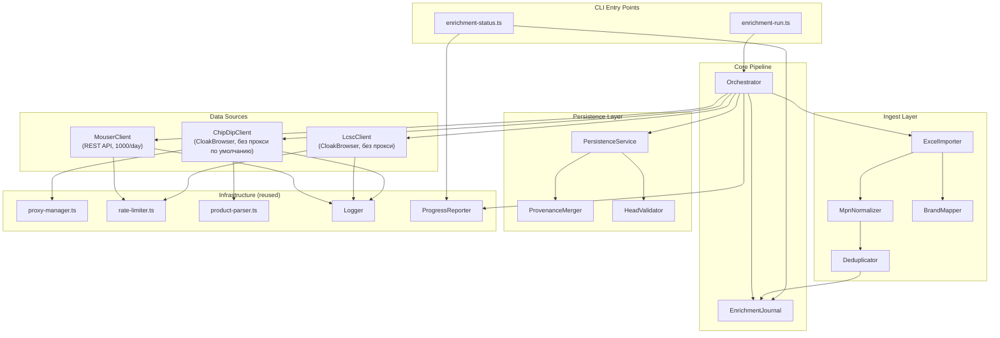
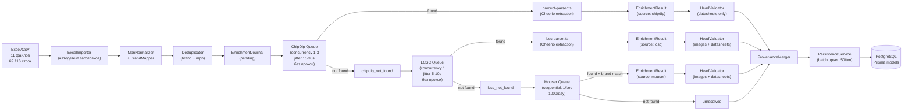

# Design Document

Дизайн: обогащение данных о товарах (product-data-enrichment)

## Overview

Фича реализует CLI-пайплайн обогащения товарных данных для **69 116 артикулов** из 11 файлов (10 xlsx + 1 csv) китайского поставщика. Пайплайн работает как автономный Node.js-скрипт (не часть Next.js runtime), запускаемый через `pnpm tsx`.

Ключевые принципы:
- **Три источника**: ChipDip (основной, русские данные) → LCSC (вторичный, английские данные) → Mouser API (третичный, английские данные для не найденных ни на ChipDip, ни на LCSC).
- **CloakBrowser без прокси** — основной режим для ChipDip и LCSC. Прокси — опциональный fallback только для ChipDip при блокировке (403).
- **Антидетекция**: рандомизация viewport, блокировка ресурсов (images/fonts/stylesheets), ротация User-Agent, лимит 180 req/hr на IP для ChipDip.
- **Переиспользование кода**: существующий `product-parser.ts` (Cheerio), `proxy-manager.ts`, `rate-limiter.ts`.
- **Идемпотентность**: повторный запуск не дублирует и не портит данные.
- **Провенанс**: каждое поле помечено источником; более сильный источник не перезаписывается слабым (ChipDip (4) > LCSC (3) > Mouser (2) > supplier-stub (1)).
- **Устойчивость**: остановка/возобновление через per-MPN журнал статусов. Полный цикл ≈ 3-4 недели.
- **Безопасность**: секреты только из `.env`, никогда в логах.

**Nexar API НЕ используется** (бесплатный тариф ≈ 10 запросов, непригоден для 69k артикулов).

## Architecture

### Диаграмма компонентов

### Диаграмма потока данных

